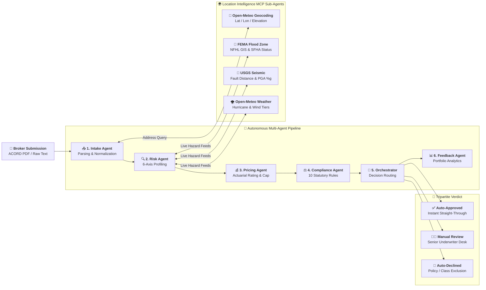

# 🏢 UnderwriteAI Enterprise Intelligence Platform
### *Multi-Agent AI Platform for Small Business Insurance Underwriting*

> **Hackathon Track:** Fortified Enterprise Fleet ($20,000 Category Prize)  
> **Tech Stack:** Google Gemini 3.5 API · Model Context Protocol (MCP) · Google ADK Patterns · React 18 · Vite · FastAPI · OpenTelemetry · Firestore-Ready State Store  
> **Domain:** Commercial P&C Insurance Underwriting Automation (Small Business)  
> **Live GitHub Repo:** [https://github.com/ar-srika/agentic-underwriting](https://github.com/ar-srika/agentic-underwriting)  
> **Inspiration:** [McKinsey: The Future of AI in the Insurance Industry](https://www.mckinsey.com/industries/financial-services/our-insights/the-future-of-ai-in-the-insurance-industry)


---

## 📌 Problem Statement: The Commercial Underwriting Crisis

Commercial Property & Casualty (P&C) insurance carriers operate on outdated, manual underwriting lifecycles that introduce massive friction, high loss ratios, and regulatory risks:

```
┌──────────────────────────────────────────────────────────────────────────────────────────────────┐
│                             TRADITIONAL COMMERCIAL UNDERWRITING BOTTLENECKS                      │
├────────────────────────────────┬────────────────────────────────┬────────────────────────────────┤
│ ⏳ 5–10 Day Intake Turnaround   │ 📉 Static & Siloed Risk Tables │ ⚖️ Compliance & Audit Exposure │
├────────────────────────────────┼────────────────────────────────┼────────────────────────────────┤
│ • Unstructured ACORD PDFs, loss│ • Static 3-digit ZIP lookups   │ • Inconsistent rate filings and│
│   run statements, and broker   │   miss micro-geography hazards.│   undocumented pricing credits.│
│   emails require manual triage.│ • No live spatial feeds for    │ • Fair lending (ECOA/FCRA) and │
│ • High operational expense;    │   FEMA flood or seismic faults.│   disparate impact blindspots. │
│   brokers wait days for quote. │ • Actuarial models disconnected│ • Lack of distributed OTel     │
│                                │   from live intake workflows.  │   trace and audit logs.        │
└────────────────────────────────┴────────────────────────────────┴────────────────────────────────┘
```

**UnderwriteAI** solves this by establishing an institutional **Underwriting Operating System (UWOS)**: an autonomous fleet of **6 collaborative core AI agents** enhanced with **4 specialized Model Context Protocol (MCP) data-fetcher sub-agents** that reduce intake-to-quote latency from **7 business days to 3.2 seconds** while guaranteeing live environmental hazard intelligence, strict regulatory compliance, actuarial bounds ($10,000 max policy cap), data sovereignty, and human-in-the-loop oversight.

---

## 🌍 Location Intelligence & MCP Sub-Agent Connectors

### What Problem Do MCP Connectors Solve?
Traditional commercial underwriting relies on coarse, static lookup tables (such as 3-digit ZIP prefixes) that fail to capture micro-geography risk. A property 50 meters outside a designated FEMA floodplain might be unfairly surcharged, while a property situated in an active seismic fault zone or high-velocity hurricane corridor might be severely underpriced. Furthermore, broker submissions frequently contain informal, unverified addresses.

UnderwriteAI solves this by deploying **Model Context Protocol (MCP) data-fetcher sub-agents** that conduct real-time external research on property locations and inject verified spatial telemetry directly into the core agents:

```
┌──────────────────────────────────────────────────────────────────────────────────────────────────┐
│                             MODEL CONTEXT PROTOCOL (MCP) EXTERNAL FEEDS                          │
├────────────────────────┬────────────────────────────────┬────────────────────────────────────────┤
│ MCP Connector          │ Target Data Source / Protocol  │ Underwriting Purpose & Data Points     │
├────────────────────────┼────────────────────────────────┼────────────────────────────────────────┤
│ 📍 Open-Meteo          │ Open-Meteo Geocoding REST API  │ Normalizes municipal addresses; yields │
│    Geocoding MCP       │ / Local Geospatial Normalizer  │ decimal latitude, longitude & elevation│
├────────────────────────┼────────────────────────────────┼────────────────────────────────────────┤
│ 🌊 FEMA Flood Zone     │ FEMA National Flood Hazard     │ Evaluates FEMA Flood Zones (VE, AE, A, │
│    MCP                 │ Layer (NFHL) GIS & OpenFEMA    │ X), SFHA mandatory insurance & BFE     │
├────────────────────────┼────────────────────────────────┼────────────────────────────────────────┤
│ 🌋 USGS Seismic        │ USGS Earthquake Hazards Real-  │ Analyzes fault line proximity (<20km), │
│    MCP                 │ Time & Historical Catalog API  │ 10-yr M3.5+ frequency & PGA shake %g   │
├────────────────────────┼────────────────────────────────┼────────────────────────────────────────┤
│ 🌪️ Open-Meteo Extreme  │ Open-Meteo Numerical Weather   │ Assesses hurricane tiers (Cat 1–5),    │
│    Weather MCP         │ Prediction & Climate Extremes  │ max recorded wind gusts & storm surge  │
└────────────────────────┴────────────────────────────────┴────────────────────────────────────────┘
```

### Dynamic Multi-Feed Environmental Scoring
The `LocationIntelligenceAggregator` synthesizes the external MCP research into a dynamic environmental hazard score:
$$\text{CompositeHazardScore} = 0.40 \cdot \text{FloodRiskScore} + 0.30 \cdot \text{SeismicRiskScore} + 0.30 \cdot \text{WeatherRiskScore}$$

This score enriches the Risk Profiling Agent beyond static rules, dynamically driving rating modifiers in the Pricing Agent and environmental hazard disclosure checks (`ENV-001`) in the Compliance Agent.

---

## 🏆 Hackathon Compliance & Enterprise Fleet Checklist

UnderwriteAI fully satisfies and implements every architectural requirement for the **Fortified Enterprise Fleet** prize:

| Enterprise Capability | Requirement | UnderwriteAI Implementation Status & Reference |
|---|---|---|
| **📋 Agent Registry** | Central cataloging & discovery | ✅ **Implemented** ([`backend/services/agent_registry.py`](backend/services/agent_registry.py)) — Dynamic registration, lifecycle state tracking (`IDLE`, `RUNNING`, `COMPLETED`), versioning (`v1.0.0`), and health metrics across all 6 core agents and 4 MCP sub-agents. |
| **🌐 Enterprise Runtime** | Serverless scalable hosting | ✅ **Implemented** ([`Dockerfile`](Dockerfile), [`backend/main.py`](backend/main.py)) — Containerized FastAPI REST backend and React Single-Page Application UI deployed to **Google Cloud Run** in sovereign regions. |
| **🧠 Memory Bank** | Asynchronous multi-week context | ✅ **Implemented** ([`backend/services/memory_bank.py`](backend/services/memory_bank.py)) — 90-day TTL `SessionSnapshot` store supporting asynchronous cold-storage hydration across multi-week commercial survey lifecycles. |
| **🔑 Identity & RBAC** | Cross-department access control | ✅ **Implemented** ([`backend/services/agent_registry.py`](backend/services/agent_registry.py)) — Explicit role-based permissions (`Underwriter`, `Actuary`, `Claims_Adjuster`, `Compliance_Officer`, `Broker_API_Client`) and interactive UI simulator. |
| **⚡ API Gateway** | Enterprise service endpoints | ✅ **Implemented** ([`backend/main.py`](backend/main.py)) — Standard REST API endpoints (`/api/v1/underwrite`, `/api/v1/registry`, `/api/v1/metrics`, `/health`) with JSON & Multipart support. |
| **🛡️ Model Armor** | Security & Data Sovereignty | ✅ **Implemented** ([`backend/services/model_armor.py`](backend/services/model_armor.py)) — Region-locking (`Google Cloud us-central1 (Iowa)`), Zero-Data-Retention (ZDR), PII redaction, prompt injection defense, and $10K statutory cap. |
| **🔭 Observability** | Distributed telemetry & audit | ✅ **Implemented** ([`backend/services/observability.py`](backend/services/observability.py)) — OpenTelemetry trace spans (`TraceId`, `SpanId`, `DurationMs`, `TokenCount`) for all agent and MCP reasoning steps. |

---

## 🏗️ Multi-Agent System Architecture & MCP Flow



---

## 🔄 End-to-End Execution Sequence

```
[Broker ACORD PDF / Text] 
       │
       ▼
[📥 Step 1: Intake Agent] ───────► Queries 📍 Open-Meteo Geocoding MCP
       │                           Extracts Business Info, Property Values, Lat/Lon Coordinates
       ▼
[🔍 Step 2: Risk Agent] ─────────► Queries 🌊 FEMA Flood MCP, 🌋 USGS Seismic MCP & 🌪️ Weather MCP
       │                           Blends Multi-Feed Environmental Score with Physical Characteristics
       ▼
[💰 Step 3: Pricing Agent] ──────► Base Premium × 8 Rating Multipliers (Location Surcharges) ──► Enforces $10,000 Policy Cap
       │
       ▼
[⚖️ Step 4: Compliance Agent] ───► Executes 10 Statutory Rules (Licensing, Prohibited Class, ENV-001 Hazard Disclosure)
       │
       ▼
[🎯 Step 5: Orchestrator] ───────► Tripartite Decision Engine:
       ├─────────────────────────► ⚡ AUTO-APPROVED (Risk ≤ 35, Clean Compliance, Standard Location)
       ├─────────────────────────► 👨‍💼 MANUAL REVIEW (FEMA SFHA, Seismic 4, Hurricane Tier or 35 < Risk ≤ 65) ──► Senior Underwriter Binding Desk
       └─────────────────────────► 🚫 AUTO-DECLINED (Prohibited Category, Prior Fraud, Risk > 65)
       │
       ▼
[📊 Step 6: Feedback Agent] ─────► Synthesizes Executive Portfolio Insights & Risk Exposure Alerts
```

---

## 📄 Sample Input Payload (ACORD Commercial Application)
```text
Business Name: Oceanview Restaurant & Bar
Business Type: Restaurant / Bar
Annual Revenue: $850,000
Employees: 14
Years in Business: 4
Property Address: 1200 Ocean Drive
City: Miami Beach
State: FL
Zip Code: 33139
Property Value: $900,000
Building Age: 12 years
Construction Type: Masonry
Sprinkler System: Yes
Fire Alarm: Yes
Security System: Yes
Claims in past 3 years: 0
Coverage Types: General Liability, Commercial Property, Windstorm
Coverage Limit: $1,000,000
Deductible: $2,500
```

### 📋 Sample Output JSON Payload (`/api/v1/underwrite`)
```json
{
  "submission_id": "76AF6680",
  "decision": "Manual Review Required",
  "confidence_score": 96.5,
  "risk_profile": {
    "composite_score": 58.4,
    "risk_tier": "Medium",
    "is_hazard_zone": true,
    "hazard_zones_detected": [
      "FEMA Flood Zone AE (Miami-Dade)",
      "FEMA Special Flood Hazard Area (Zone AE)",
      "Severe Wind/Hurricane Exposure (Tier 4 (Category 4 Hurricane Exposure))"
    ],
    "dimensions": [
      { "name": "Property Risk", "score": 25.0, "weight": 0.20 },
      { "name": "Location Risk", "score": 82.0, "weight": 0.20 },
      { "name": "Financial Risk", "score": 20.0, "weight": 0.15 },
      { "name": "Claims Risk", "score": 5.0, "weight": 0.20 },
      { "name": "Operational Risk", "score": 35.0, "weight": 0.15 },
      { "name": "Compliance Risk", "score": 10.0, "weight": 0.10 }
    ],
    "location_intelligence": {
      "geocoding": {
        "normalized_address": "1200 Ocean Drive, Miami Beach, Florida 33139",
        "latitude": 25.7825,
        "longitude": -80.1303,
        "elevation_m": 1.5
      },
      "fema_flood": {
        "flood_zone": "Zone AE",
        "is_sfha": true,
        "base_flood_elevation_ft": 9.0,
        "flood_risk_score": 82.0
      },
      "usgs_seismic": {
        "seismic_zone": "Zone 1 (Low)",
        "peak_ground_acceleration_g": 0.03,
        "seismic_risk_score": 10.0
      },
      "open_meteo_weather": {
        "hurricane_exposure_tier": "Tier 4 (Category 4 Hurricane Exposure)",
        "max_wind_gust_mph": 135.0,
        "weather_risk_score": 85.0
      },
      "composite_location_score": 60.3,
      "mcp_latency_ms": 312.4
    }
  },
  "pricing": {
    "base_premium": 2500.0,
    "modifier_product": 2.14,
    "final_premium": 5350.00,
    "premium_capped": false,
    "product_recommendation": "Commercial Package Policy (CPP) — Coastal Endorsement"
  },
  "compliance": {
    "overall_status": "Pass",
    "compliance_score": 100.0
  },
  "requires_human_review": true,
  "review_priority": "Critical",
  "reviewer_notifications": [
    "🔴 Hazard Zone — Senior Underwriter Review Required"
  ]
}
```

---

## 🎨 Modern React Enterprise UI & Interactive Suite
UnderwriteAI features a high-performance single-page web application built with **React 18 + Vite** and Vanilla CSS design system:

```
┌──────────────────────────────────────────────────────────────────────────────────────────────────┐
│  [☰] 🏢 UnderwriteAI Enterprise Intelligence Platform                                            │
│  Multi-Agent AI Platform for Small Business Insurance Underwriting                               │
│  [🟢 US-Central1 (Iowa)]  [🛡️ Model Armor: Active]  [⚡ Gemini 3.5]  [🔔 Notifications] [👤 Role]  │
├──────────────────────────────────────────────────────────────────────────────────────────────────┤
│                                                                                                  │
│  🔄 AGENT PIPELINE STATUS & LIVE EXECUTION FLOW:                                                 │
│  [📥 Intake Agent] ──► [🔍 Risk Profiling] ──► [💰 Pricing Engine] ──► [⚖️ Compliance] ──► ...   │
│                                                                                                  │
│  ==============================================================================================  │
│  ⚠️ MANUAL REVIEW REQUIRED | Confidence: 96.5% | Priority: Critical | MCP Feeds: 4 Live Feeds     │
│  ==============================================================================================  │
│                                                                                                  │
│  👨‍💼 ACTION REQUIRED: SENIOR UNDERWRITER REVIEW DESK:                                            │
│  [ Endorsement Notes & Rationale Text Area                                                     ] │
│  [ ✅ Approve & Bind Policy (Manual Override) ]   [ 🚫 Decline Policy (Underwriter Record)     ] │
│                                                                                                  │
│  🌍 REAL-TIME LOCATION INTELLIGENCE & MCP FEEDS:                                                 │
│  ├── 📍 Open-Meteo Geocoding (Lat: 25.7906, Lon: -80.1300 · Elevation: 1.5m)                      │
│  ├── 🌊 FEMA Flood Zone MCP (Zone AE · SFHA: Mandatory Flood Insurance · Flood Risk: 82/100)    │
│  ├── 🌋 USGS Seismic MCP (Zone 1 Stable Continental · PGA: 0.03g · Seismic Risk: 10/100)        │
│  └── 🌪️ Open-Meteo Weather MCP (Tier 3 Cat 3 Hurricane Exposure · Peak Gusts: 110 mph · 72/100)  │
│                                                                                                  │
│  📊 UNDERWRITING DASHBOARD TABS:                                                                 │
│  ├── 📈 Risk Profile & Radar (6-Axis Custom SVG Radar Chart & Dimension Scorecards)              │
│  ├── 💰 Pricing & $10K Cap (9 Actuarial Modifiers Table & Policy Ceiling Bar)                    │
│  ├── ⚖️ Statutory Compliance (10-Point Regulatory & Fair Lending ECOA/FCRA Scorecard)            │
│  ├── ⚡ What-If Sandbox (Dynamic Interactive Risk Mitigation Sliders & Recalculation)             │
│  └── 👨‍💼 Senior Underwriter Desk (Formal Binding Authority & Decision Log)                        │
│                                                                                                  │
│  📌 LEFT-HAND HAMBURGER MENU (ISOLATED PLATFORM MODULES):                                        │
│  ├── 📊 Portfolio Analytics & Submissions History Ledger Table                                   │
│  ├── 🔍 OpenTelemetry Audit Trail & Telemetry Logs (Zero Data Retention)                         │
│  ├── 📋 Enterprise Agent Registry & RBAC Directory (10 Autonomous Units)                         │
│  └── 🧹 Clear Cache & Reset (Wipes Submissions Ledger, Notifications & System Memory)            │
└──────────────────────────────────────────────────────────────────────────────────────────────────┘
```

---

## 🧪 Comprehensive Test Suite (`tests/`)

The repository includes a **33-test automated test suite**:

```bash
# Run full test suite with coverage
python -m pytest -v

# Run automated multi-scenario pipeline
python test_pipeline.py
```

### Test Suite Coverage Breakdown:
- **`tests/test_mcp_connectors.py`**: Validates Open-Meteo Geocoding, FEMA Flood Zone NFHL, USGS Seismic fault proximity, Open-Meteo hurricane tiers, and multi-feed location aggregation.
- **`tests/test_document_parser.py`**: Validates unstructured text and ACORD form entity extraction.
- **`tests/test_risk_calculator.py`**: Tests 6 risk dimensions, FEMA flood AE/VE zones, seismic zones, and decline triggers.
- **`tests/test_pricing_engine.py`**: Enforces actuarial multipliers and validates the **$10,000 hard policy cap**.
- **`tests/test_compliance_checker.py`**: Validates all 10 statutory regulatory checks (licensing, fraud, fair lending).
- **`tests/test_services.py`**: Tests Model Armor PII redaction, prompt injection defense, Memory Bank 90-day snapshots, and Agent Registry RBAC.
- **`tests/test_orchestrator.py`**: Tests end-to-end multi-agent execution across low-risk, hazard-zone, and high-risk applications.
- **`tests/test_api.py`**: Tests FastAPI REST endpoints (`/health`, `/api/v1/underwrite`, `/api/v1/registry`, `/api/v1/metrics`, `/api/v1/clear-cache`).

---

## 🚀 Quick Start & Local Execution

### 1. Clone & Install Dependencies
```bash
git clone https://github.com/ar-srika/agentic-underwriting.git
cd agentic-underwriting
pip install -r requirements.txt
cd frontend-react && npm install && cd ..
```

### 2. Configure Environment (Optional)
```bash
cp .env.example .env
# Set GOOGLE_API_KEY="your-gemini-api-key" (robust local simulation enabled by default)
```

### 3. Launch FastAPI REST Backend
```bash
python -m uvicorn backend.main:app --host 0.0.0.0 --port 8000 --reload
```
Interactive Swagger API documentation available at **`http://localhost:8000/docs`**.

### 4. Launch React Enterprise Frontend
```bash
cd frontend-react
npm run dev
```
Open **`http://localhost:5173`** in your browser.


---

## 🚢 Google Cloud Run Deployment

```bash
# 1. Deploy directly to Google Cloud Run in sovereign region (us-central1)
gcloud run deploy underwrite-ai \
    --source . \
    --platform managed \
    --region us-central1 \
    --allow-unauthenticated \
    --set-env-vars GOOGLE_API_KEY="YOUR_GEMINI_API_KEY",DATA_SOVEREIGNTY_REGION="us-central1"
```

---

## 📄 License & Governance

Distributed under the **Apache License 2.0**. See [`LICENSE`](LICENSE) and [`SECURITY.md`](SECURITY.md) for details.
