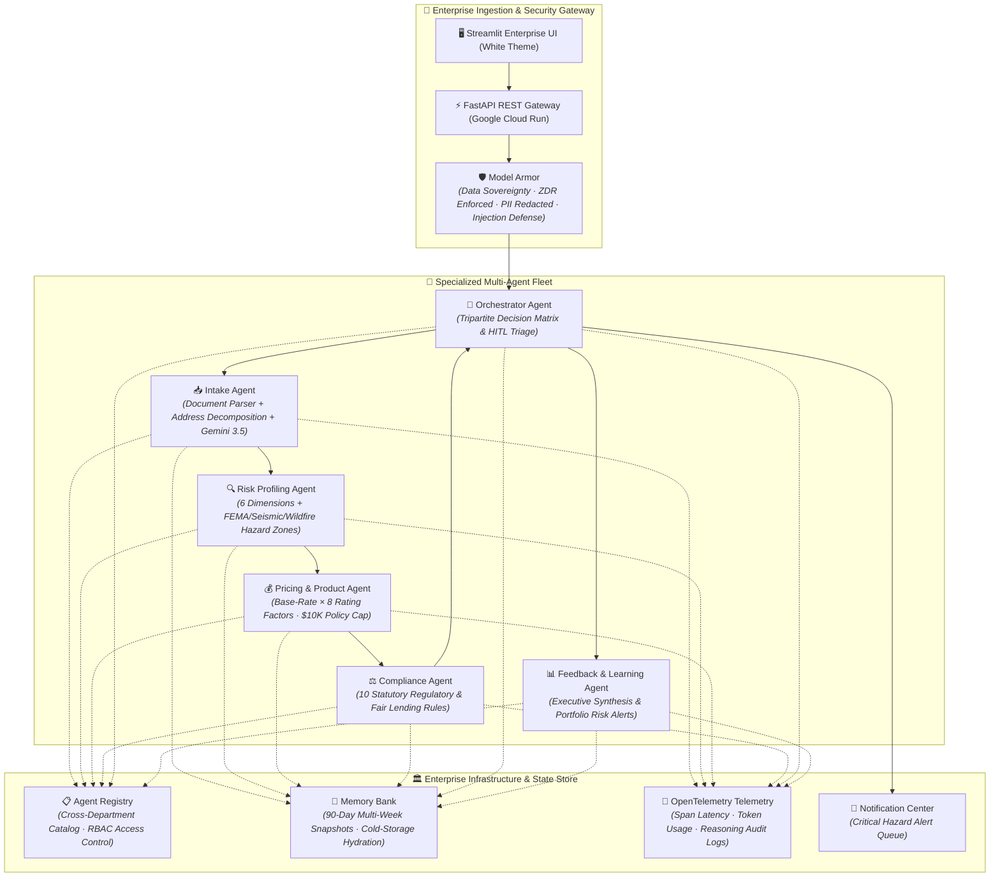

# 🏢 UnderwriteAI — Enterprise Multi-Agent Underwriting Platform

> **Hackathon Track:** Fortified Enterprise Fleet ($20,000 Category Prize)  
> **Tech Stack:** Google Gemini 3.5 API · Google ADK Patterns · FastAPI · Streamlit · Google Cloud Run · OpenTelemetry · Firestore-Ready State Store  
> **Domain:** Commercial P&C Insurance Underwriting Automation (Small Business)  
> **Inspiration:** [McKinsey: The Future of AI in the Insurance Industry](https://www.mckinsey.com/industries/financial-services/our-insights/the-future-of-ai-in-the-insurance-industry)

---

## 📌 Executive Summary

Commercial insurance carriers face **slow, fragmented, and compliance-vulnerable underwriting lifecycles**:
- Unstructured intake of ACORD forms, broker emails, and loss run PDFs taking 5–10 business days.
- Siloed risk assessment, subjective manual pricing, and inconsistent underwriting decisions.
- Regulatory vulnerabilities in fair lending (ECOA/FCRA), auditability, and state rate filings.
- Operational friction in balancing straight-through processing (STP) with human underwriter oversight.

**UnderwriteAI** delivers an institutional **"Underwriting Operating System" (UWOS)** powered by **6 specialized, collaborative AI agents**. The system autonomously orchestrates document parsing, 6-dimensional risk profiling, actuarial pricing strictly capped at $10,000, 10-point regulatory compliance, human-in-the-loop triage for natural hazard zones, and portfolio learning — all shielded by **Model Armor** and audited via **OpenTelemetry**.

---

## 🏛️ Enterprise Fleet Standards Alignment

UnderwriteAI is engineered to satisfy the **Fortified Enterprise Fleet** standard:

```
┌─────────────────────────────────────────────────────────────────────────────────────────────┐
│                    FORTIFIED ENTERPRISE FLEET ARCHITECTURAL PILLARS                         │
├─────────────────────────────────────────┬───────────────────────────────────────────────────┤
│ 1. Enterprise Infrastructure Hooks      │ FastAPI Gateway, Cloud Run, OpenTelemetry, Pub/Sub│
│ 2. Cross-Department RBAC Catalog        │ Central Agent Registry with Multi-Department APIs │
│ 3. Multi-Week Asynchronous Context      │ 90-Day Session Snapshots & Cold-Storage Hydration │
│ 4. Data Sovereignty & Zero-Data-Retention│ Region-Lock (us-central1), PII Redaction, Model Armor │
└─────────────────────────────────────────┴───────────────────────────────────────────────────┘
```

---

### 1. 🌐 Scalable Network of Institutional Agents Hooking into Official Enterprise Infrastructure
- **Decoupled RESTful Agent Microservices**: Each of the 6 specialized agents is cataloged with standard REST API endpoints (`/api/v1/agents/intake`, `/api/v1/agents/risk`, `/api/v1/agents/pricing`, `/api/v1/agents/compliance`, `/api/v1/agents/orchestrator`, `/api/v1/agents/feedback`) served via **FastAPI** on **Google Cloud Run**.
- **Google Agent Development Kit (ADK) Patterns**: Sequential and hierarchical agent coordination with isolated execution scopes, deterministic tool calls, and model parameter tuning.
- **Enterprise OpenTelemetry (OTel) Telemetry**: Every agent action emits distributed trace spans (`TraceId`, `SpanId`, `DurationMs`, `TokenCount`, `ExecutionStatus`) hooking into enterprise APMs (Google Cloud Trace, Datadog, Dynatrace).
- **Asynchronous Execution & Queue Resilience**: Background worker task support with non-blocking polling and reactive notifications.

---

### 2. 📋 Cataloged for Cross-Department Use with Role-Based Access Control (RBAC)
Agents are published in a central **Agent Registry** ([`backend/services/agent_registry.py`](backend/services/agent_registry.py)) and shared across multiple business units with explicit permission boundaries:

| Agent | Version | Primary Owner | Authorized Cross-Department Use | RBAC Access Roles | Enterprise Endpoint |
|---|:---:|---|---|---|---|
| **📥 Intake Agent** | `v1.0.0` | Submission Processing | Underwriting · Claims Triage · Broker Portal · Policy Admin | `Underwriter`, `Claims_Adjuster`, `Broker_API_Client` | `/api/v1/agents/intake/parse` |
| **🔍 Risk Profiling Agent** | `v1.0.0` | Risk Assessment | Underwriting · Actuarial Science · Loss Control · Reinsurance | `Underwriter`, `Risk_Engineer`, `Actuary`, `Auditor` | `/api/v1/agents/risk/evaluate` |
| **💰 Pricing & Product Agent** | `v1.0.0` | Actuarial & Pricing | Underwriting · Actuarial Science · Product Mgmt · Finance | `Underwriter`, `Actuary`, `Pricing_Analyst`, `Product_Owner` | `/api/v1/agents/pricing/calculate` |
| **⚖️ Compliance Agent** | `v1.0.0` | Legal & Compliance | Legal · Compliance · Internal Audit · Risk Governance | `Compliance_Officer`, `Legal_Counsel`, `Auditor`, `Underwriter` | `/api/v1/agents/compliance/validate` |
| **🎯 Orchestrator Agent** | `v1.0.0` | Underwriting Operations | Underwriting · Executive Leadership · Operations | `Senior_Underwriter`, `Operations_Manager`, `CUO` | `/api/v1/agents/orchestrator/execute` |
| **📊 Feedback & Learning Agent** | `v1.0.0` | Analytics & Strategy | Executive Board · Portfolio Analytics · Actuarial | `Chief_Underwriting_Officer`, `Portfolio_Manager` | `/api/v1/agents/feedback/synthesize` |

---

### 3. 📅 Safely Maintaining Context Across Weeks of Asynchronous Operations
In commercial underwriting, policies often require multi-week underwriting cycles (e.g. waiting for physical property loss-control surveys, broker supplemental questionnaires, or reinsurer sign-offs):
- **90-Day Asynchronous Session Snapshots**: The **Memory Bank** ([`backend/services/memory_bank.py`](backend/services/memory_bank.py)) generates an immutable `SessionSnapshot` record with a 90-day time-to-live (TTL).
- **Cold-Storage State Hydration**: Underwriters or brokers can resume an in-flight submission weeks later via `resume_session(session_id)` to re-hydrate the complete multi-agent reasoning chain, pricing multipliers, and audit trails without data loss or context drift.
- **Human-in-the-Loop Triage Hub**: Queues real-time alerts (`CRITICAL`, `WARNING`, `INFO`) that persist across sessions until explicitly acknowledged by licensed underwriting officers.

---

### 4. 🛡️ Production Data Interaction: Compliance, Data Sovereignty & Security
UnderwriteAI enforces strict institutional security policies via **Model Armor** ([`backend/services/model_armor.py`](backend/services/model_armor.py)) and the **Compliance Engine** ([`backend/tools/compliance_checker.py`](backend/tools/compliance_checker.py)):
- **Data Sovereignty & Regional Locking**: Guarantees all compute and model operations remain within designated sovereign regions (`Google Cloud us-central1 (Iowa)` / `eu-west3`).
- **Zero-Data-Retention (ZDR)**: Validates that confidential applicant financial statements, proprietary loss histories, and applicant data are processed in-memory and shielded from public foundation model training.
- **Model Armor Guardrails**:
  - *Prompt Injection Defense*: Blocks jailbreaks, instruction overrides, and system prompt tampering.
  - *Field-Level PII Redaction*: Redacts SSNs, credit cards, bank accounts, and personal identifiers before passing prompts to foundation models.
  - *Actuarial Bounds Enforcement*: Ensures calculated premiums never violate statutory floors ($500) or exceed the small business ceiling (**$10,000**).
- **10-Point Statutory Regulatory Audit**: Evaluates licensing verification (REG-001), prohibited business screening (REG-002), prior fraud cancellations (REG-003), rate adequacy (FIN-001), underinsurance (FIN-002), environmental hazard disclosure (ENV-001), claims frequency (CLM-001), fair lending anti-discrimination (FRN-001), data quality (DAT-001), and PII security (SEC-001).

---

## 🏗️ Multi-Agent System Architecture



---

## 🎨 Enterprise White GUI & Underwriter Experience

The platform features a clean enterprise interface (matching Guidewire PolicyCenter, Duck Creek, and Salesforce Financial Services Cloud):

1. **🏢 Global Enterprise Navigation Bar**: Top app bar with brand breadcrumbs (`Commercial P&C › Small Business Underwriting › BOP/CPP Fleet`) and live telemetry status chips (`🟢 US-Central1 (Iowa)`, `🛡️ Model Armor: Active`, `⚡ Gemini 3.5 Pro`, `🏢 Tenant: Fleet #8820`).
2. **🚦 Live Sequential Pipeline Visualizer**: Real-time progress updates with traffic-light status badges:
   - `🟢 DONE`: Completed agent nodes.
   - `🟡 IN-FLIGHT`: Animated pulsing active execution step.
   - `⚪ STANDBY`: Downstream waiting nodes.
   - `🔴 FAILED`: Policy-blocked nodes.
3. **👨‍💼 Human-in-the-Loop Senior Underwriter Binding Desk**:
   - For all submissions requiring manual triage (e.g. coastal flood zones, wildfire interfaces, compliance flags), underwriters can review trigger reasons, enter binding comments/endorsements, and click **`✅ Approve & Bind Policy`** or **`🚫 Decline Submission`**.
   - Assigns dedicated first-class `DecisionType.UNDERWRITER_APPROVED` and `DecisionType.UNDERWRITER_DECLINED` statuses with officer signature (`Senior Underwriter (UW-ID: #4092)`), timestamp, and audit trail.
4. **📊 Enterprise Portfolio Analytics & STP Attribution**:
   - 6-metric volume tracker: **Total Volume**, **⚡ Auto-Approved (STP)**, **👨‍💼 UW Approved**, **⏳ Pending Review**, **🚫 Auto-Declined (STP)**, **👨‍💼 UW Declined**.
   - 5-way interactive decision distribution donut chart.
   - Live activity stream with dedicated status badges and underwriter notes preview.
5. **⚡ Interactive What-If Risk Sandbox**:
   - Replaced plain checkboxes with **Salesforce Lightning styled risk engineering toggle cards**:
     - `🔥 Commercial Fire Sprinkler System [Impact: -12 Risk Pts · Premium Discount]`
     - `🚨 24/7 Monitored Fire & Smoke Alarm [Impact: -5 Risk Pts]`
     - `📹 Central Security & Monitored CCTV [Impact: -6 Risk Pts]`
     - `🏗️ Roof Condition & Renovation Selector`
   - Instant recalculation of risk scores, actuarial pricing, and auto-approval triage upon toggling safeguards.
6. **📈 Risk Radar & Pricing Waterfall**:
   - 6-axis Plotly radar chart overlaying threshold boundaries for auto-approval ($35$) and manual review ($65$).
   - Actuarial breakdown illustrating base premium progression and rating modifiers with an explicit **$10,000 policy cap marker**.

---

## 🚀 Quick Start & Spin-Up

### Prerequisites
- Python 3.10+
- Google Cloud Gemini API Key (optional — falls back to robust local simulation)

### 1. Clone & Install
```bash
git clone https://github.com/YOUR_REPO/agentic-underwriting.git
cd agentic-underwriting
pip install -r requirements.txt
```

### 2. Configure Environment
```bash
cp .env.example .env
# Set GOOGLE_API_KEY="your-gemini-api-key"
```

### 3. Run Automated Integration Verification
```bash
python test_pipeline.py
```

### 4. Launch Enterprise Streamlit Frontend
```bash
streamlit run frontend/app.py --server.port 8501
```
Open **`http://localhost:8501`** in your browser.

### 5. Launch FastAPI REST Microservices
```bash
uvicorn backend.main:app --reload --port 8000
```
Swagger API docs available at **`http://localhost:8000/docs`**.

---

## 🚢 Google Cloud Run Deployment

```bash
# 1. Build and push container to Google Artifact Registry / GCR
gcloud builds submit --tag gcr.io/YOUR_PROJECT_ID/underwrite-ai

# 2. Deploy to Cloud Run in sovereign region (us-central1)
gcloud run deploy underwrite-ai \
    --image gcr.io/YOUR_PROJECT_ID/underwrite-ai \
    --platform managed \
    --region us-central1 \
    --allow-unauthenticated \
    --set-env-vars GOOGLE_API_KEY="YOUR_GEMINI_API_KEY",DATA_SOVEREIGNTY_REGION="us-central1"
```

---

## 🏆 Hackathon Evaluation Alignment

| Judging Dimension | Weight | UnderwriteAI Implementation |
|---|:---:|---|
| **Innovation & Operational Utility** | **40%** | Full-stack machine-first underwriting desk replacing 5-day manual turnaround; automated straight-through processing for low-risk policies, hazard triage for coastal/seismic properties, an interactive What-If mitigation simulator, and senior underwriter override desk. |
| **Architectural Discipline & Tech Stack** | **30%** | Decoupled 6-agent fleet with Google ADK patterns, OpenTelemetry trace spans, Model Armor security guardrails, deterministic actuarial rating ($10K cap), and Firestore-compatible persistence. |
| **Demo & Production Readiness** | **30%** | Enterprise white GUI matching Guidewire/Salesforce Financial Services Cloud, live pipeline visualizer with realistic pacing, comprehensive unit/integration test suite, Docker containerization, and Cloud Run deployment. |
